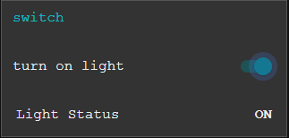
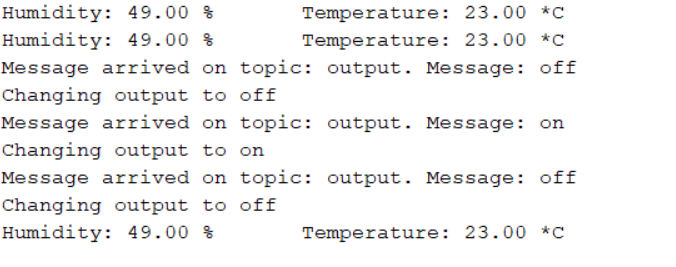

### Esp32 with node-red and mqtt cloud.

#### flow chart.

This chart shows the flow from and to mqtt broker in the cloud.
there are three input mqtt nodes - humidity, temperature and lightstatus that are subscribing to the topics mentioned. These node updates the ui.
The esp32 is subscribing to a topic called output. This topic can take to strings as input - "on" or "off", and will turn the esp32 builtin light on or off according to the message.
There is also a function that turn on and off the light based on what temperature it is.

#### The ui.

The ui is actually not supposed to have control over the light, but in this case for simplicity reason I chose to have a switch.
The switch responsibility can easily be extracted out from the ui component to a controller component.

#### switch control.

#### Arduino prints.

