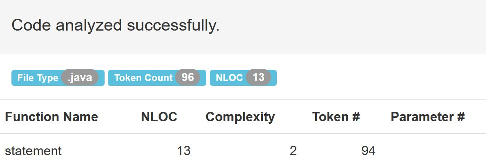

## Oblig 1 - Refactor statement method

### Original statement method
```java
public String statement() {
        double totalAmount = 0;
        int frequentRenterPoints = 0;
        Enumeration rentals = _rentals.elements();
        String result = "Rental Record for " + getName() + "\n";
        while (rentals.hasMoreElements()) {
            double thisAmount = 0;
            Rental each = (Rental) rentals.nextElement();

            // determine amount for each line
            switch (each.getMovie().getPriceCode()) {
                case Movie.REGULAR:
                    thisAmount += 2;
                    if (each.getDaysRented() > 2)
                        thisAmount += (each.getDaysRented() - 2) * 1.5;
                    break;
                case Movie.NEW_RELEASE:
                    thisAmount += each.getDaysRented() * 3;
                    break;
                case Movie.CHILDRENS:
                    thisAmount += 1.5;
                    if (each.getDaysRented() > 3)
                        thisAmount += (each.getDaysRented() - 3) * 1.5;
                    break;
            }

            // add frequent renter points
            frequentRenterPoints ++;
            // add bonus for a two day new release rental
            if ((each.getMovie().getPriceCode() == Movie.NEW_RELEASE) &&
                    each.getDaysRented() > 1) frequentRenterPoints ++;

            //show figures for this rental
            result += "\t" + each.getMovie().getTitle()+ "\t" +
                    String.valueOf(thisAmount) + "\n";
            totalAmount += thisAmount;
        }
        //add footer lines
        result += "Amount owed is " + String.valueOf(totalAmount) + "\n";
        result += "You earned " + String.valueOf(frequentRenterPoints) +
                " frequent renter points";
        return result;
    }
```
The method statement has clearly to much responsibility and the code here can be converted into smaller chunks of code with less responsibility. My main goal here was to move the switch-case to a method - determineAmount() in the Rental class. Since the Rental class holds information about the movie and days rented. I also converted totalAmount, FrequentRenterPoints and result into globals for pratical purposes. I also moved footer lines to a method.
```java
 public String statement() {
 
         _result = "Rental Record for " + _name + "\n";
 
         Enumeration rentals = _rentals.elements();
 
         while (rentals.hasMoreElements()) {
 
             Rental each = (Rental) rentals.nextElement();
 
             double thisAmount = each.determineAmount();
 
             addRenterPoints(each);
 
             totalAmount += thisAmount;
 
             _result += "\t" + each.getMovie().getTitle()+ "\t" + String.valueOf(thisAmount) + "\n";
         }
 
         resultfooterLine();
 
         return _result;
 
     }
```
### Measure SLOC & McCabe's Cyclomatic Complexity - Before and after.


#### Refactored


#### Rental Example 2 - refactored rentalpoints into rentalClass
```java
 public String statement() {
 
         Enumeration rentals = _rentals.elements();
 
         while (rentals.hasMoreElements()) {
 
             Rental each = (Rental) rentals.nextElement();
 
             double thisAmount = each.determineAmount(frequentRenterpoints++);
 
             totalAmount += thisAmount;
 
             _result += "\t" + each.getMovie().getTitle()+ "\t" + String.valueOf(thisAmount) + "\n";
         }
 
         resultfooterLine();
 
         return _result;
 
     }
```


### Complexity - Before and after


#### Refactored



#### RentalExample2 has 11 lloc


